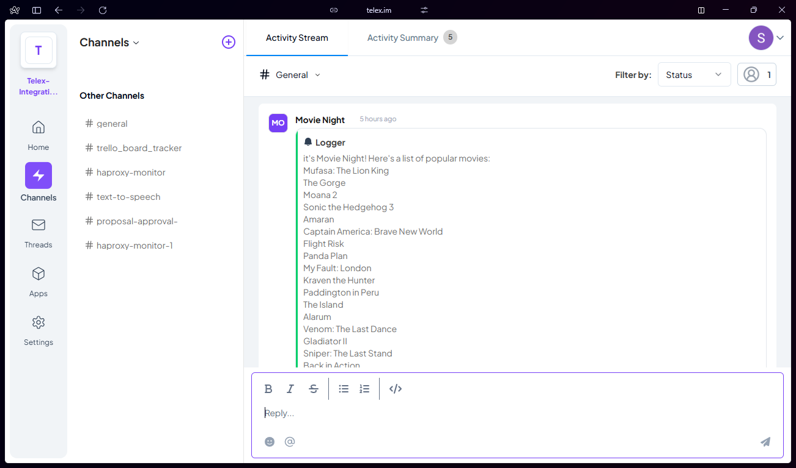

````markdown
# Movie Night Integration

Movie Night is a simple integration that fetches a list of popular movies from an external API at scheduled intervals and logs them to a Telex channel.

## Features

- Fetches a list of popular movies from The Movie Database (TMDb)
- Logs the movie list to a Telex channel at a specified interval
- Customizable interval settings

## Setup Instructions

### Prerequisites

- [Node.js](https://nodejs.org/) installed
- [Telex](https://telex.im/) account
- API key from [The Movie Database (TMDb)](https://www.themoviedb.org/)

### Installation

1. Clone this repository:
   ```sh
   git clone https://github.com/your-repo/movie-night.git
   cd movie-night
   ```
````

2. Install dependencies:
   ```sh
   npm install
   ```
3. Create a `.env` file in the project root and add the following:
   ```env
   PORT=4000
   MOVIE_API_KEY=your_tmdb_api_key_here
   ```

### Running the Application

To start the server:

```sh
npm run dev
```

The server will run on `http://localhost:4000` by default.

### Testing the Integration

To manually trigger the movie fetch and logging:

```sh
curl -X POST http://localhost:4000/tick
```

You should see a log of popular movies in your Telex channel.

### Deployment

To deploy the integration:

1. Use a cloud provider (e.g., Heroku, Vercel, or AWS) to host your application.
2. Ensure your `.env` variables are properly set in your hosting environment.
3. Set up a cron job or use the provided scheduler to trigger `fetchExternalData()` at the desired interval.

## API Endpoints

### Root Endpoint

- **GET `/`**
  - Returns a JSON response confirming the integration is active.

### Integration Metadata

- **GET `/integration.json`**
  - Provides metadata about the integration, including settings and description.

### Manual Trigger

- **POST `/tick`**
  - Triggers the `fetchExternalData` function manually.

## Screenshots

Below are screenshots of the integration working in a Telex channel:



For any questions or issues, feel free to reach out!

```

```
